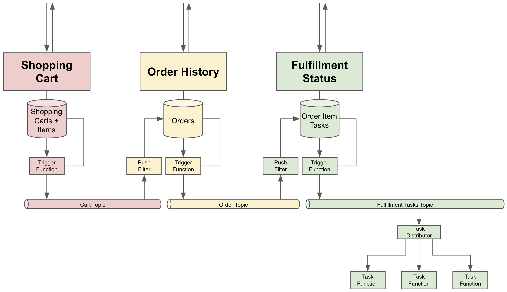

# A Google Cloud Platform e-Commerce Prototype

**TIP:** Use the table of contents dropdown menu located to the left 

```diff
- UNDER CONSTRUCTION
-
- This project is incomplete and may never be completed!!   
-
- Currently working on:
-    * Firestore index defintions
-    * System testing of Order & Fulfillment services
```

This is a proof of concept (POC) project used to experiment with and demonstrate implementing:

* gRPC services with Cloud Run
* Entity tree storage with Firestore
* Firestore CDC event generation to EventArc
* Loosely coupled bounded contexts via
  * Pub/Sub triggered business logic Cloud Functions
  * EventArc triggered business logic Cloud Functions
  * Cloud Task triggered business logic Cloud Functions
  
**IMPORTANT: In no way should this be considered to be the foundation for an actual e-commerce system. 
E-commerce is just the toy scenario chosen to explore GCP capabilities.

## Index of Child README Documents

This top-level README is mostly concerned with setting up the build environment and running the project wide 
`Makefile`. Deeper information about the proof of concept scenario and some of the hoops to jump through
to successfully build and deploy services to the Google Cloud Platform can be found in the following child
pages:

#### The Scenario

* [Overview](docs/SCENARIO.md)
* [Infrastructure Setup](infrastructure/README.md)
* [The gRPC Cart Microservice](cart/README.md)
* [The gRPC Order Microservice](order/README.md)
* [The gRPC Fulfillment Orchestration Microservice](fulfillment/README.md)
* [The Cart Firestore Trigger Function](carttrigger/README.md)
* [The Order from Cart Topic Consumer](orderfromcart/README.md)
* [The Order Firestore Trigger Function](ordertrigger/README.md)
* [The Order To Fulfillment Topic Consumer](ordertofulfill/README.md)
* [The Fulfillment Task Firestore Trigger Function](tasktrigger/README.md)
* [The Fulfillment Task Distribution Function](taskdistrib/README.md)
* [The Fulfillment Task Email Function](taskdistrib/README.md)

#### How To ...
* [Use BloomRPC to invoke gRPC Cloud Run services](docs/BLOOMRPC.md)
* [Grant service account access for Cloud Run services](docs/DATASTORE_ACCESS.md)
* [Grant Cloud Build access to private Git repos](docs/PRIVATEREPOS.md)
* [Build leaner Go service containers](docs/LEAN.md)

## Directory Structure

The following directory and file tree does not show every file in the project but, rather, provides a map to the most 
significant locations:

```text
    └── mikebway <-- gRPC service and protocol buffer schema definitions specific to this project.
.
├── api             <-- gRPC service and protocol buffer message schema definitions.
│   ├── google      <-- Cloned Google protocol buffer definitions for standard types like phone
│   │                   numbers etc.
│   │
│   │                   Note: cloning to support local code generation is considered good
│   │                   practice.
│   │
│   └── mikebway    <-- gRPC service and protocol buffer schema definitions specific to this
│                       project. 
│
├── cart            <-- Source code and Makefile for the cart-service Cloud Run container.
│ 
├── carttrigger     <-- Source code and Makefile for the cart-trigger Firestore trigger Cloud
│                       Function.
│ 
├── docs            <-- Additional README documentation, not specific to any service or module.
│ 
├── fulfillment     <-- Source code and Makefile for the fulfilment-service Cloud Run container. 
│ 
├── infrastructure  <-- Contains a Makefile that can setup or teardown Pub/Sub topics etc. 
│ 
├── order           <-- Source code and Makefile for the order-service Cloud Run container. 
│ 
├── orderfromcart   <-- Source code for a Pub/Sub subscriber Cloud Function that consumes 
│                       shopping cart publications from the carttrigger function and records
│                       new orders in the order data set.
│ 
├── ordertofulfill  <-- Source code for a Pub/Sub subscriber Cloud Function that consumes 
│                       order publications from the ordertrigger function and records
│                       order item fulfillment tasks in the task data set.
│ 
├── ordertrigger    <-- Source code and Makefile for the order-trigger Firestore trigger Cloud
│                       Function.
│ 
├── pb              <-- Go library module generated from the gRPC service and protocol buffer
│                       message schema. This is referenced by service modules to facilitate
│                       implementation of the gRPC APIs. 
│ 
├── tasktrigger     <-- Source code and Makefile for the task-trigger Firestore trigger Cloud
│                       Function.
│ 
├── testutil        <-- Go library module intended solely to support unit testing of other  
│                       modules.
│ 
├── types           <-- Go library module implementing shared structure types such as PostalAddress, 
│                       Person, Timestamp, etc.
│ 
├── go.work         <-- A Go workspace configuration file allowing for the local resolution of cross
│                       module references without the module code first having to be committed and
│                       pushed to GitHub. 
│ 
├── Makefile        <-- The master Makefile that, in turn, invokes sub-directory for the service and
│                       library modules.
│ 
└── README.md       <-- This documentation file
```

## Local Prerequisites

The following need to be installed locally to build and deploy the project components:

* Homebrew [brew.sh](https://brew.sh/)
* `git` (this is included with the [Apple Developer CLI Tools](https://mac.install.guide/commandlinetools/3.html))
* `make` (this is included with the [Apple Developer CLI Tools](https://mac.install.guide/commandlinetools/3.html))
* The Go development tool set: [go.dev](https://go.dev/)
* Three Protocol Buffer schema to code generation tools:
  * `brew install protobuf`
  * `brew install protoc-gen-go`
  * `brew install protoc-gen-go-grpc`
* The `gcloud` Google Cloud SDK: [cloud.google.com/sdk/docs/install-sdk](https://cloud.google.com/sdk/docs/install-sdk)
* A `protoc` plugin to generate a single `.proto` file from the [api/mikebway/cart/cart.proto](api/mikebway/cart/cart.proto)
  file and its imports. This is needed for the [infrastructure/Makefile](infrastructure/Makefile) to register the 
  shopping cart Protocol Buffer message as a Pub/Sub topic schema:
  * Set the `GOBIN` environment variable, typically to `$HOME/go/bin`
  * Ensure `$GOBIN` is on your path
  * `go install github.com/alpancs/protoc-gen-pubsub-schema@latest`
    To allow `protoc` to generate the single file from the [api/mikebway/cart/cart.proto](api/mikebway/cart/cart.proto)

## For Local and Remote Testing

* Firestore Database Emulator
  * `brew install openjdk`
  * `gcloud components update`
  * Start with `make firestore` in a shell window
  * Stop with `make stop-firestore` in a second shell window
* Pub/Sub Emulator
  * Same `brew` and `gcloud` commands as above preparing for the Firestore emulator
  * Start with `make pubsub` in a shell window
  * Stop with `make stop-pubsub` in a second shell window
* BloomRPC, the equivalent of Postman for testing gRPC APIs
  * `brew install --cask bloomrpc`

### Non-essential but Potentially Useful

* Docker CLI tools - not essential but might be useful:
  * For Intel Macs - `brew install docker hyperkit minikube skaffold kubectl`
  * For Apple Silicon M1/M2 Macs: - `brew install colima minikube skaffold docker kubernetes-cli`

## Google Cloud Prerequisites

1. Your Google Cloud account must define a project with the same ID as that found in `PROJECT_ID` values defined in
   the `Makefile` for each of the service and cloud function modules contained in this repository, i.e. `./cart` etc.
   Unless you have forked this project (see below), that will be `poc-gcp-ecomm`.

2. The Firestore service must have been enabled for the project.

3. Grant the Cloud Build service account access to the Secrets Manager, Cloud Functions, and Cloud Run. See 
   [Configuring access for Cloud Build Service Account](https://cloud.google.com/build/docs/securing-builds/configure-access-for-cloud-build-service-account)

4. Follow the instructions at [Grant Cloud Build access to private Git repos](docs/PRIVATEREPOS.md) to allow
   Cloud Build access to the code repository. The `SSH_KEY`secret that you set up will be referenced by
   component `cloudbuild.yaml` files to allow CLoud Build to reference Go package/module versions referenced
   by `go.mod` files.

5. After successfully running `make deploy` for the first time, but before attempting to invoke any 
   of the gRPC APIs you must create service accounts for each of them and grant those accounts read-write
   access to the Datastore service. See [Granting Datastore Access](docs/DATASTORE_ACCESS.md).

## Forking the Repository

If you fork this repository for use in a different Google Cloud account, or whatever, you will
need to consider:

1. Replacing all references to `github.com/mikebway` with your own git service provider and organization name.


2. Running `go mod tidy` in each of the Go module directories to reset the package references.


3. Changing the `PROJECT_ID` values defined in `Makefile` for each of the service and cloud function modules.


4. If you are committing to a private repository, follow the [instructions](docs/PRIVATEREPOS.md) for configuring your 
`cloudbuild.yaml` and other `gcloud build` inputs to allow Go to pull Go modules without suffering from the dreaded error:
    ```text
    Error: fatal: could not read Username for 'https://github.com': terminal prompts disabled
    ```

## Running the Makefile

Entering `make` without any parameters displays the following usage help:

```text
NOTE The 'build' step invokes gcloud build and requires that the full project source be first 
committed and pushed to GitHub.
help        List of available commands
build       Build all the project components (invoking gcloud build for each service/function)
deploy      Deploy all project components to Google Cloud
test        Compile code and run unit tests locally on all components that support them
firestore   Run the Firestore emulator
protobuf    Compile the protocol buffer / gRPC schema files
```

Run from this top-level, builds and deploys can take a long time to complete and be frustrating to debug when 
failures occur many minutes into the process. As an alternative, you can change your working directory to that
of any of the module and service child directories and run the module specific `Makefile` configurations you 
find there to build and/or deploy just that one component.

**NOTE:** The [infrastructure/Makefile](infrastructure/Makefile) is not invoked from this top-level [Makefile](Makefile).
To establish the one-time infrastructure, or tear it down, you must change to that directory and run `make` there. 

## Unit Testing With the Firestore Emulator

Many of the unit tests require that a local instance of the Firestore emulator be running. That is the case
whether using `make test`, indirectly as a dependency of `make build` or `make deploy`, or from within an
IDE.

The easiest way to achieve this is to use `make firestore` in a second terminal window. This will ensure 
that the Firestore emulator is spun up for the correct Google Cloud Project ID to listen to the port expected
by the unit test code.

Unfortunately, running under `make`, the Firestore emulator cannot be stopped with simply by tapping Ctrl+C
a couple of times. Executing `make stop-firestore` in your other terminal window will take care of that.


