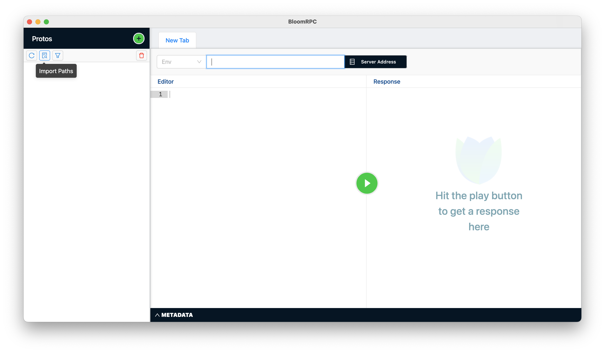
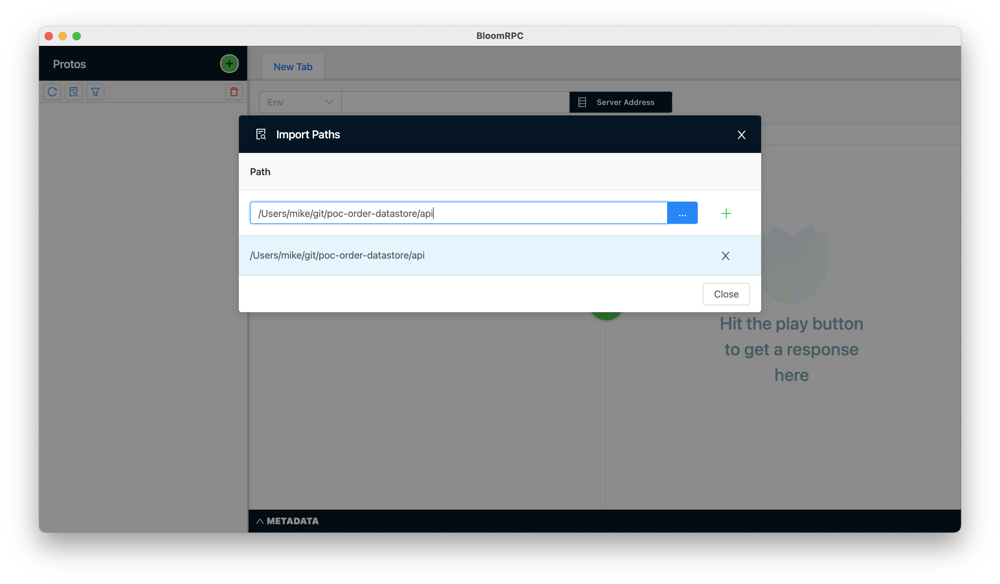
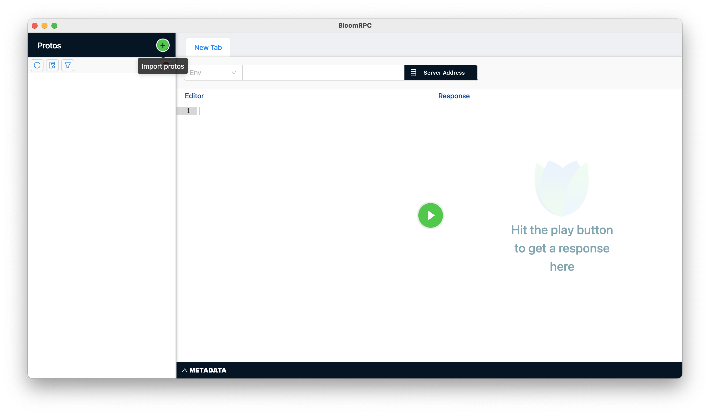
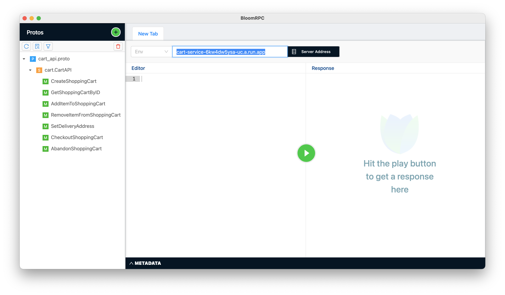
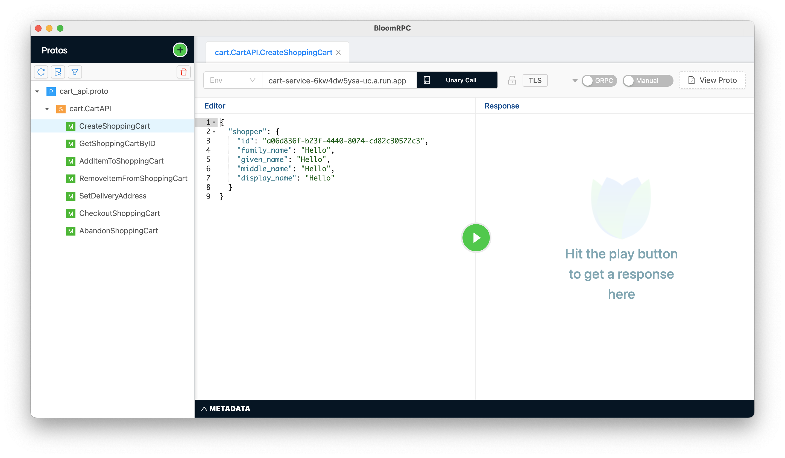
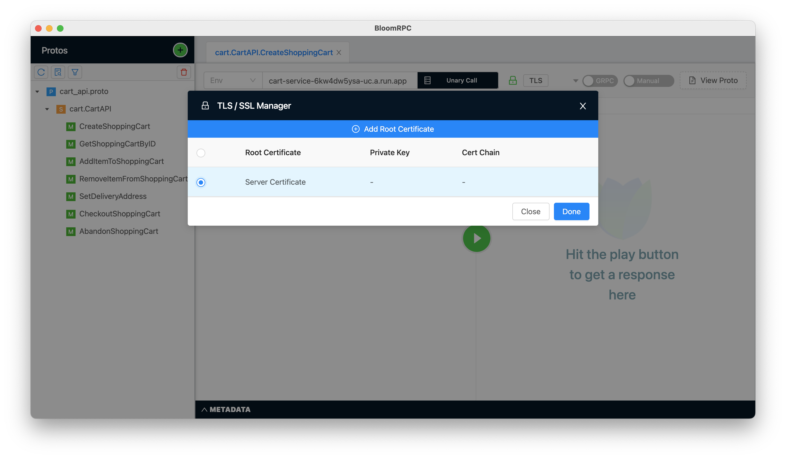
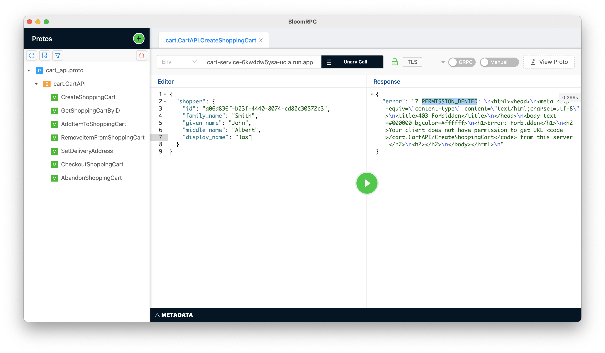
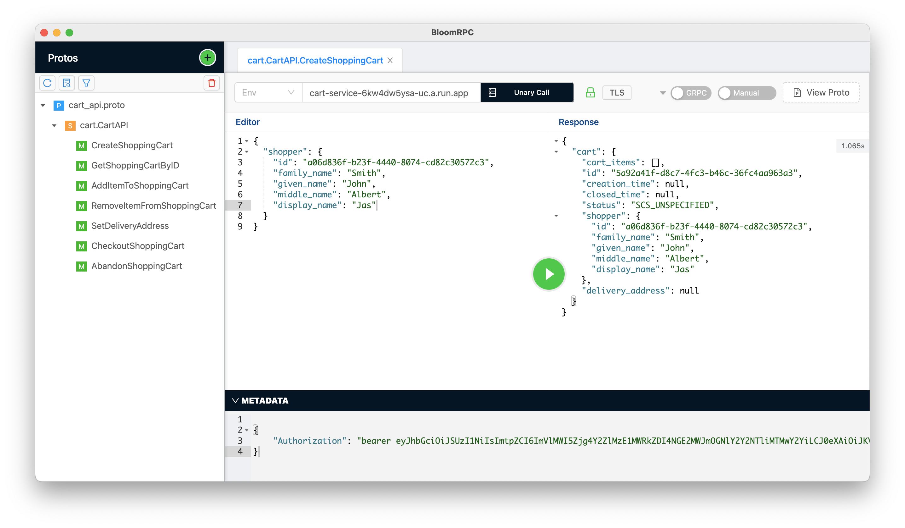

# Using BloomRPC to Invoke gRPC Cloud Run Services

## Setting the Protocol Buffer Schema Root Path

Start BloomRPC and click the **Import Paths** button of the **Protos** panel in the top left of the window:



Set the `./api` directory as the root location for all protocol buffer schema files:



## Import the API Schema `.proto` Files

Click the green "+" **Import Protos** button in the top left of the **Protos** panel on the top left side of the 
BloomRPC window

)

Add the `*_api.proto` files found under the `./api/mikebway/*` directories. Note that the other message 
definition schema files referenced by those files will automatically be pulled in as well.


## Set the Service DNS Name, TLS Certificate Source

Add the DNS name of the service that you wish to invoke to the address bar. Warning: do not include the 
`https://` prefix if you copy the name from the Cloud Run display in the GCP Console. For example:

```text
cart-service-6kw4dw5ysa-uc.a.run.app
```



## Select an API Method to Invoke

In the left side **Protos** panel, click the API method that you wish to invoke, e.g. **CreateShoppingCart**. The
**Editor** tab will then be filled with a JSON template representing the input parameters for the API that
you selected:

 

## Specify the use of Server TLS Certificates

Click the **TLS** button next to the right of the address bar and select the **Server Certificate** radio button:



## Fill in the Parameter Template Values for the Chosen API Method

In the **Editor** panel, replace the the template values with suitable test values of your own choosing.

If you go ahead and hit the **Play** button now you will get a **`PERMISSION_DENIED`** error. There is one more thing
that you need to do.



## Add the Authorization Bearer Token

The last thing to be done is set an authorization bearer token in the meta data. First, you need to obtain that token
value by running the following in a terminal shell that has first authenticated with GCP:

```shell
gcloud auth print-identity-token
```

This will produce a long base64 encoded string which you must copy and paste into the **METADATA** panel 
wrapped in a JSON structure like this:

```json
{
    "Authorization": "bearer eyJhbGc... // ...sybeFA"
}
```

Now, with the bearer token in place, pressing the **Play** should succeed and return a result like this:



**NOTE:** The bearer token has a relatively short lifespan of just a few minutes. If one of your subsequent calls 
fails with an **UNAUTHENTICATED** error, just create a new token and replace it in the **METADATA**.

## Calling Additional APIs

Clicking on a different API in the **Protos** panel will open a new tab in the **Editor/Response** panel.
Until it times out, you can copy-and-paste the authorization metadata JSON to share it across multiple tabs. 


