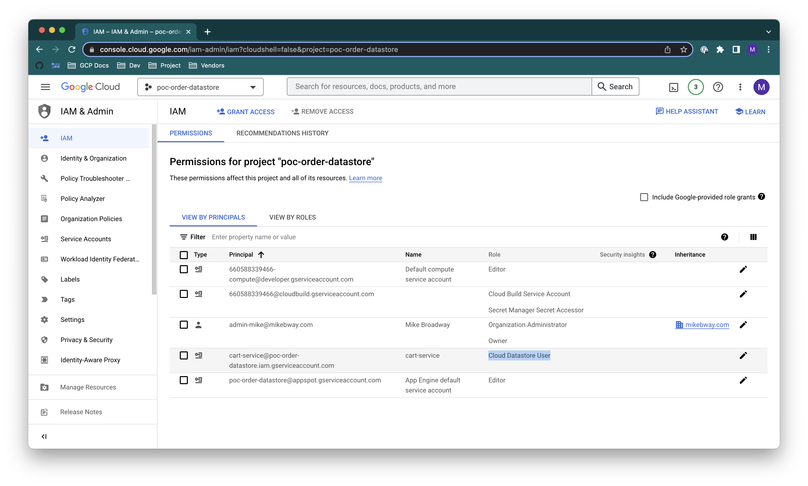

# Granting Datastore Access to Services

Best practice is to grant a Cloud Run service access to the Google Cloud project's Datastore via though granting 
a role to the client service specific `service account`. First the service must have a service account! 

## Create a Service Account for the Service

Go to the **Cloud Run** section of the GCP Web Console and find the service that you wish to give a service
account to.

Select the service to display its details, then click **EDIT & DEPLOY NEW VERSION**

Select the **SECURITY** tab. If the **Service account** dropdown selector is already displaying the name
of a service specific account (i.e. named for the service and with the service ID as the subject of an email 
address value) then skip ahead to the
[Assign the Datastore User Role](#assign-the-datastore-user-role-to-the-service-account) step below.

Click the **Service account** dropdown selector and check if there is already a service account defined
for the service (i.e. named for the service and with the service ID as the subject of an email address value). 
This is unlikely but if it is the case then select that entry in the drop-down and click the **DEPLOY** button
to activate it for the service and then skip ahead to the 
[Assign the Datastore User Role](#assign-the-datastore-user-role-to-the-service-account) step below.

In the most likely case, there is not existing service account so click **CREATE NEW SERVICE ACCOUNT** button.

The default service account name and ID values displayed are probably fine but you can change them if you have
good reason to do so and then click **DONE**.

After closing the **Create new service account** panel, the new service account name should be displayed in
the **Service account** dropdown selector. Click the the **DEPLOY** button
to activate it for the service.

## Assign the Datastore User Role to the Service Account

Switch to the **IAM** section of the GCP Web Console. It should default to showing **Permissions for project ...**
panel associated with the **IAM** entry at the top of the left side menu. Anyway, that's the view you want to have.

Click the **GRANT ACCESS** button at the top of the **Permissions for project ...** panel.

In the **Grant access to ...** overlay on the right side of the page, start to type the name of your service in
the **New principals** field. A type ahead display will populate as you enter more characters of the service name.
When you can see the one you want, click in the type ahead match list to save further typing.

Click in the **Select a role** dropdown box. From here you have a couple of ways to get to the specific
Datastore access role that we want to add. 

* You can either scroll down the service list on the left side of the dropdown panel until you find **Datastore**
and select that. Then scroll down the **Roles** list on the right side of the dropdown panel until you find 
**Cloud Datastore User** to select that.

or

* You can start typing the name of the role you want, "*datastore user*", in the **Filter** box and select the 
only matching option.

Finally, click **Save** and you are all done! The **IAM** **Permissions for project ...** list should now
include your service with **Cloud Datastore User** in the **Role** column: 

