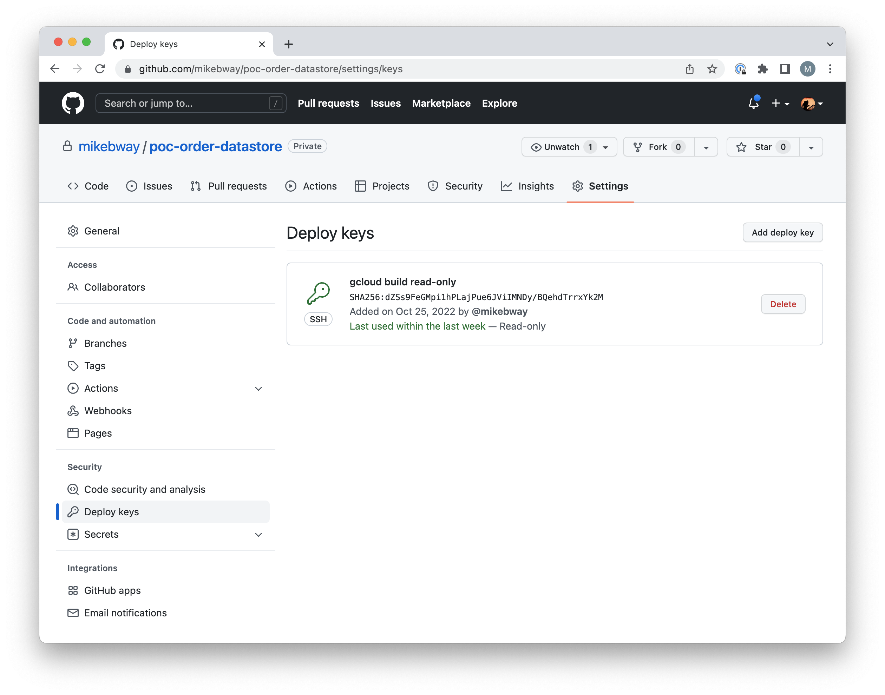

# Go Cloud Build Access to Private Git Repos

## The Problem

Unlike Node's `npm` module repositories and Maven's Jar file repositories, Go library modules are referenced
as source code in `git` repository servers such as [github.com](https://github.com). This is because Go
library modules are compiled at build time along with the client code that is using them, resulting in
highly compact binary programs containing only those specific elements of the library modules that are
needed fro the client code to operate.

A sometimes awkward downside of this approach is that the first run of `go build` operation against 
the freshly cloned source code of a Go program project will need to pull the additional source code
of all the program's library dependencies from additional remote `git` servers. This is rarely an 
issue on a properly configured developer laptop with all the necessary SSH gets etc already in place.

And it is not usually a problem for a Google Cloud Build CI/CD pipeline either, as long as the library 
sources are being pulled from well known public servers for which the standard Go cloud builder steps
come preconfigured with access to the public repositories for all of the major `git` hosting vendors
([github.com](https://github.com), [gitlab.com](https://gitlab.com), [bitbucket.com](https://bitbucket.com),
etc). 

But, if the library source comes from a private repository for which the naked, out-of-the-box, instantiated
new each time cloud builder step has no access keys already installed, then you will almost certainly see 
this horrible and misleading message in your logs:

```text
Error: fatal: could not read Username for 'https://github.com': terminal prompts disabled
```

How do you get around that? You can if you (or your company) own the private repo(s) in question.

## The Solution

Google provides the essential details for the solution in its [Accessing GitHub from a build via SSH keys](https://cloud.google.com/build/docs/access-github-from-build)
page but not in the context of building a Cloud Run service or Cloud function. Adding commentary for
a Cloud Run service build, this can be summarized as:

1. Create an [SSH key pair](https://cloud.google.com/build/docs/access-github-from-build#create_a_ssh_key).

   * If establishing the keys for a team or enterprise CI/CD pipeline, don't use the email address of an individual
   team member for the key but instead use that of a team, group, or mailing list. You want to use an address that
   won't become invalid when someone leaves the team/company.

   * Use the stronger and more recent `ed25519` algorithm rather than `rsa` unless the remote `git` host has not
     joined the 21st century yet. Don't specify a passphrase, leave that blank.
     ```shell
     ssh-keygen -t ed25519 -C "your_email@example.com"
     ```

2. [Store the private SSH key in the GCP Secret Manager](https://cloud.google.com/build/docs/access-github-from-build#store_the_private_ssh_key_in)
   of your project. As used in the `cloudbuild.yaml` files, the name of the secret should be the concatenation of
   the project ID and `_deploy`.

3. [Add the public SSH key to your private repository's deploy keys](https://cloud.google.com/build/docs/access-github-from-build#add_the_public_ssh_key_to_your_private_repositorys_deploy_keys)
   or your organization's keys.

   * If you only need access to one or two repositories then you can associate the public SSH key with just
   those one or two repositories as read-only **deploy keys**. All of the well known `git` servers support
   these repository specific **deploy keys** defined in the repository settings rather than the organization
   settings.
    
   * Alternatively, if multiple team or enterprise repositories are involved, you can set a read/write SSH key
   for the whole organization but you will need to be more protective of the private key in the Secrets Manager
   if you do that - you don't want that key to escape into the wild and be used to shred your entire source 
   code property or worse (have strangers adding backdoors etc).

4. [Grant permissions to the Cloud Build service account](https://cloud.google.com/build/docs/access-github-from-build#grant_permissions)
   * In other words, give Cloud Build access to the Secret Manager so that builds can retrieve the public 
     SSH key.

5. [Add the public SSH key to known hosts](https://cloud.google.com/build/docs/access-github-from-build#add_the_public_ssh_key_to_known_hosts)
   * Remember that step when you first use SSH to connect to a remote server and you are asked if the server
     should be recognized in future and you say y/n? This is a about making it so that the Cloud Build builders
     that pull code from GitHub or wherever don't have to ask that question with nobody around to give an answer:
     we answer the question before it is asked by storing the servers identity key in the SSH `known_hosts` file
     of the builder. To do that, we need a copy of the target `git` hosts SSH identity key, like so:
     ```shell
     ssh-keyscan -t rsa github.com > known_hosts.github
     ```
     
6. Finally, we [configure the build](https://cloud.google.com/build/docs/access-github-from-build#configure_the_build),
   i.e. add to the `cloudbuild.yaml` file:
   * The example given by Google is not for a Cloud Run service so it leaves something for the reader to figure
     out. We'll do that for you here, add the green `+` lines to your `cloudbuild.yaml` file:
```diff
  steps:
+ # Copy the GitHub repository deploy SSH key from the secrets manager so that
+ # the build will be able to retrieve sibling modules from our private repo.
+ # Also, copy the GitHub domain name as a known host for SSH.
+ - name: 'gcr.io/cloud-builders/git'
+   secretEnv: ['SSH_KEY']
+   entrypoint: 'bash'
+   args:
+     - -c
+    - |
+       echo "$$SSH_KEY" >> /root/.ssh/id_ed25519
+       chmod 400 /root/.ssh/id_ed25519
+       cp known_hosts.github /root/.ssh/known_hosts
+       git config --global url."git@github.com:mikebway".insteadOf "https://github.com/mikebway"
+   volumes:
+     - name: 'ssh'
+       path: /root/.ssh
+     - name: 'git'
+       path: /root/.gitconfig

  # Build the service binary
  - name: 'golang:1.19-buster'
    args: ['go', 'build', '-v', '-o', 'service']
+   volumes:
+     - name: 'ssh'
+       path: /root/.ssh
+     - name: 'git'
+       path: /root/.gitconfig

  # Build the docker image
  - name: 'gcr.io/cloud-builders/docker'
    args: [
        'build',
        '-t', 'gcr.io/$PROJECT_ID/cart-service',
        '-f', 'Dockerfile',
        '.']

  # Push our generated image to teh container registry
  images:
    - 'gcr.io/$PROJECT_ID/cart-service'

+ # Fetch the SSH private key that allows "deploy" read access to sibling
+ # modules in our monorepo.
+ availableSecrets:
+   secretManager:
+     - versionName: projects/$PROJECT_ID/secrets/${PROJECT_ID}_deploy/versions/latest
+       env: 'SSH_KEY'

```
